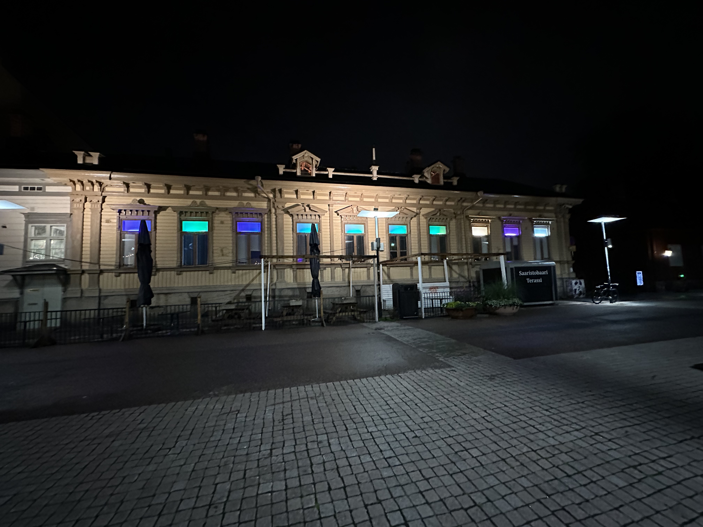

# Lumo Project

You can find the Lumo web tool here https://lumo-lights.vercel.app/. You can also run it locally (instructions below).

Please join #lumo-project in Slack and feel free to send PRs to this repository if (when) you find something not working. Thanks!



## Technical background

The Lumo system consists of 10 Philips Hue Play Gradient tubes each of which is divided into 3 segments, having 30 RGB channels in total. We use 4 different Philips Hue controllers, each controlling 6-9 channels. Maximum number of channels a controller can have in streaming mode is 10.

We have a separate backend software (currently outside of this repository) which controls the Hue controllers via a Websocket connection at roughly 25 frames per second.

## Animations

An animation is an array of **frames**, and it doesn't currently have a max limit for the frame count. We run the animations roughly at 25 frames per second, so for a 10 second animation you need 250 frames.

A **frame** is an array of 30 RGB colors (10 windows, each with 3 segments). Each RGB color is presented as an array with 3 numbers with values from 0 to 255. First number determines the amount of Red, 2nd Green, and 3rd is for Blue.

```
const onlyRed = [255, 0, 0];
const onlyGreen = [0, 255, 0];

const frame1 = [
  onlyRed, // 1st window starts here
  onlyRed,
  onlyRed,
  onlyGreen, // 2nd window starts here
  onlyGreen,
  onlyGreen,
  ... // rest of the windows
];

const frame2 = [
  onlyGreen, // 1nd window starts here
  onlyGreen,
  onlyGreen,
  onlyRed, // 2st window starts here
  onlyRed,
  onlyRed,
  ... // rest of the windows
];

const myAnimation = [
  frame1,
  frame2,
  ... //rest of the frames
];
```

## Writing animations

You can write and test your animations either by hitting the "Edit" button in the Lumo web tool and pasting in your animation code into the editor or by running the Lumo tool locally (instructions below) and modifying the `animations.ts` file. In the latter method you can use Typescript, but in the web editor you need to stick to Javascript.

Important! Editor expects you to write a function that will return the animation array:

```
() => {
  ... // frame1 and frame2 code here

  const myAnimation = [
    frame1,
    frame2,
    ... //rest of the frames
  ];

  return myAnimation;
}
```

## Utilities and helper functions

In order to make writing the animations a bit easier, there is a collection of utility functions (`src/utils/color-utils`) which are useful in making the animations

### interpolateColor

`interpolateColor` is one of building blocks which will take two RGB colors and calculate the colors in between.

```
const white = [255, 255, 255];
const red = [255, 0, 0];
const steps = 10;

// returns an array of 10 RGB colors, spread between `red` and `white`
const interpolated = Utils.interpolateColor(red, white, steps);
```

### interpolateChannels

`interpolateChannels` is the equivalent of `interpolateColor` but it will take in two frames (aka channels) with 30 RGB colors each and interpolate each color separately.

```
const steps = 10;

// returns an array of 10 frames, with colours interpolated between the colors in `frame1` and `frame2`
const interpolated = Utils.interpolateChannels(frame1, frame2, steps);
```

### changeHue

`changeHue` can be used to change the Hue of a color. Takes in a color to change and degrees (0-360) of change.

```
// returns turquoise-ish color instead of red
Utils.changeHue([255, 0, 0], 180);
```

> See https://en.wikipedia.org/wiki/Hue for more details

### rgbToHSL

`rgbToHSL` is utility function which can be used to calculate the HSL value of a color if you need saturation or lightness values for example.

```
Utils.rgbToHSL([255, 0, 0]);
```

### hslToRGB

`hslToRGB` can be used to calculate RGB value back from HSL.

```
// h is Hue, values 0-360 (degrees)
// s is Saturation, values 0.0 to 1.0
// l is Luminance, values 0.0 to 1.0
Utils.hslToRGB({ h: 180, s: 1, l: 1 });
```

> See https://en.wikipedia.org/wiki/HSL_and_HSV for more details.

### Creating a simple animation

Basically there is no restrictions how you create the array of frames. You can even use an external app for that and just paste the frames in the editor if you want.

> Tip! Try to make your animation start and end in a frame that look similar to avoid a visible "jump" when the animation starts from the beginning.

If you want to code an animation though, one way to get started is to create a set of keyframes and then interpolate the frames in between them:

```
// let's first make a helper function which creates a frame
() => {
  const createFrameWithOneColor = color => Array(30).fill(color);

  // then, let's create 10 key frames with a random color each.
  const keyframes = Array(10).fill(0).map(() => createFrameWithOneColor([Math.random() * 255, Math.random() * 255, Math.random() * 255]));

  // then, let's interpolate each keyframe to smoothly (50 steps) transition to the next
  const interpolated = keyframes.flatMap((_, i) => i < keyframes.length - 1
        ? Utils.interpolateChannels(keyframes[i], keyframes[i + 1], 50)
        : [keyframes[i]])

  // finally, let's duplicate the frames in reverse order to make the animation restart smoothly from the beginning
  const animation = interpolated.concat(interpolated.reverse());

  return animation;
}

```

## Running animations in the web tool

- Select a animation from "Select animation" dropdown
- The timeline shows which frame is currently shown
- Timeline can be dragged between frames
- "Edit" opens up an editor which you can use to update and test your animations

> Disclaimer: the editor isn't very good at showing if your animation code has issues. Check your browser console log for any errors.

> Disclaimer 2: although the close button on the editor dialog says "Close and Save", changes are automatically saved after each keystroke

## Sharing you animations

You can join #lumo-project and paste your code for others to try out! You can also make a PR to `animations.ts` and the animation can be added permanently!

### Developing locally

This is a [Next.js](https://nextjs.org/) project bootstrapped with [`create-next-app`](https://github.com/vercel/next.js/tree/canary/packages/create-next-app).

#### Getting Started

First, run the development server:

```bash
yarn dev
```

Open [http://localhost:3000](http://localhost:3000) with your browser to see the result.
